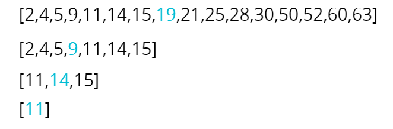

# Binary Search

- Binary search is a much faster form of search
- Rather than eliminating one element at a time, you can eliminate half of the remaining elements at a time
- Binary search only works on sorted arrays!
- Divide and Conquer  
  **Time Complexity** => best = O(1) worst = O(log n) average = O(log n)

**How Does It Work?**

- Select mid point.
- Then look desired value is greater than mid point or less than mid point.
- If less than mid point, choose new mid point on left side of old mid point.
- Continue this operation until finding this value.

**EXAMPLE:** Suppose we're searching for 13  

