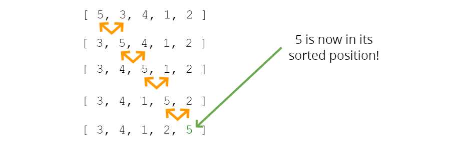

# Bubble Sort

A sorting algorithm where the largest values bubble up to the top.

There is swap operation. Firstly, 0.index is compared with 1.index. If 0.index > 1.index , their positions are swaped. If 0.index <= 1.index, their positions will be the same as before. Then 1.index and 2.index are compared. This operation continues through array. The biggest element place end of array. This is first operation. After first operation, second operation starts. But last element is not included in this operation. because we know this is largest. In third operation, last 2 element is not included.



**Time Complexity** => best = O(n) worst = O(n^2)  average = O(n^2)  
**Space Complexity** => O(1)

**ES5**
```
function swap(arr, idx1, idx2) {
  var temp = arr[idx1];
  arr[idx1] = arr[idx2];
  arr[idx2] = temp;
}
```

**ES2015**
```
const swap = (arr, idx1, idx2) => {
  [arr[idx1],arr[idx2]] = [arr[idx2],arr[idx1]];
}
```
