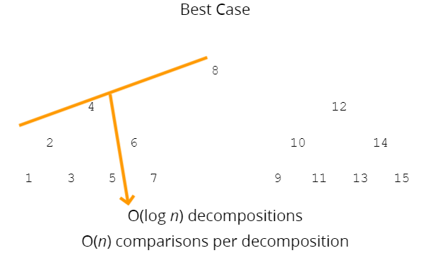
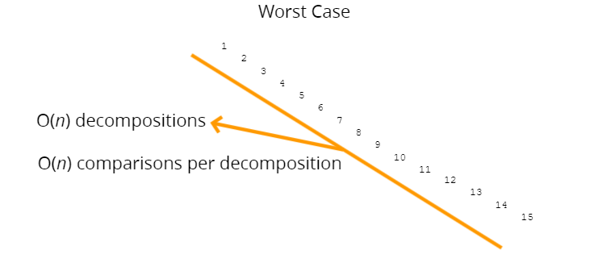

# Quick Sort
- Like merge sort, exploits the fact that arrays of 0 or 1 element are always sorted
- Works by selecting one element (called the "pivot") and finding the index where the pivot should end up in the sorted array
- Once the pivot is positioned appropriately, quick sort can be applied on either side of the pivot

**How Does It Work?**
- Pick a pivot number. 
- Less than of pivot number goes to left side of pivot number. 
- Greater than of pivot number goes to left side of pivot number.
- Then, pick a new pivot number from left side and right side of previous pivot number.
- Less than of pivot number goes to left side of pivot number. 
- Greater than of pivot number goes to left side of pivot number.
- keep going to operation until new pilot number has a single element on left side and right side.  

**Time Complexity** => best = O(n log n) worst = O(n^2) average = O(n log n)  
**Space Complexity** => O(log n)  

  
