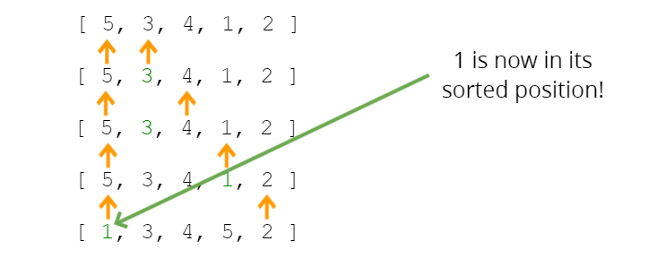

# Selection Sort

Similar to bubble sort, but instead of first placing large values into sorted position , it places small values into sorted position.
Firstly, 0.index is compared all element of array. Then, it swaps with smallest value which it is less than its value. If there is no value less than its own value, the swap will not take place.

<h1 class="note">Note</h1>
Selection Sort potentially is better than bubble sort.

In bubble sorting, swapping is over and over. In selection sort find smallest firstly, then swap.

**Time Complexity** => best = O(n^2) worst = O(n^2) average = O(n^2)  
**Space Complexity** => O(1)

