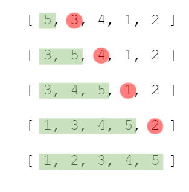

# Insertion Sort
Start by picking second element of array. Moves according to where the number in an index will be placed before it. This element is compared with the all elements to its left. If it is less than compared element's value, they swap.

**Time Complexity** => best = O(n) worst = O(n^2)  average = O(n^2)  
**Space Complexity** => O(1)
