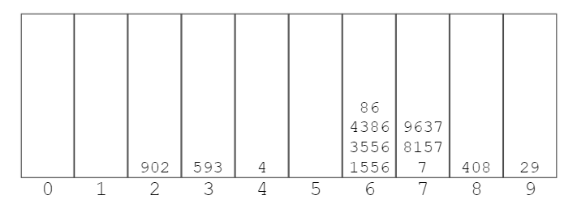
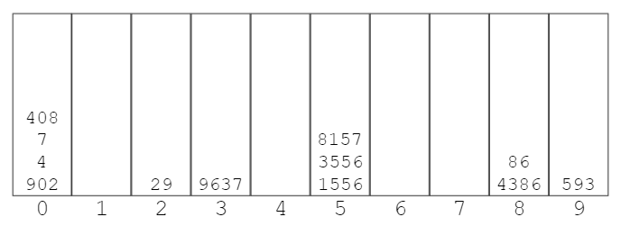
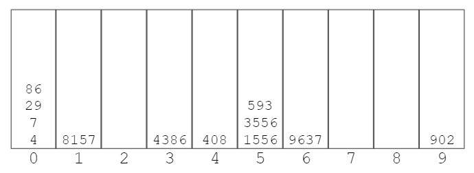
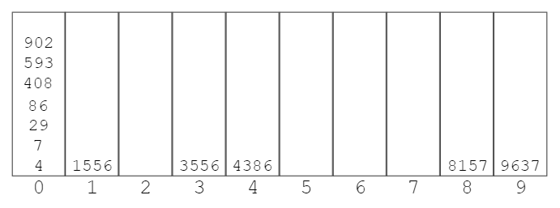

# Radix Sort
- Radix sort is a special sorting algorithm that works on lists of numbers
- It exploits the fact that information about the size of a number is encoded in the number of digits.  
- More digits means a bigger number!
- It never makes comparisons between elements!
- Numbers must be in base 10.

## How Does It Work?
Look at the last digit and if the last digit is 0, it is put box 0. If it is 1, it is put box 1. The second to last digit is looked at and placed in boxes accordingly. It continues as long as the longest string. For example, The long of longest array is 3. This operation continues three times.

[1556, 4, 3556, 593, 408, 4386, 902, 7, 8157, 86, 9637, 29] - **Look Last Digit**
  
[902, 593, 4, 1556, 3556, 4386, 86, 7, 8157, 9637, 408, 29] - **Look at the Second Digit from the Last**
  
[902, 4, 7, 408, 29, 9637, 1556, 3556, 8157, 4386, 86, 593] - **Look at the Third Digit from the Last**
  
[4, 7, 29, 86, 8157, 4386, 408, 1556, 3556, 593, 9637, 902] - **Look at the Fourth Digit from the Last**
  
[4, 7, 29, 86, 408, 593, 902, 1556, 3556, 4386, 8157, 9637]

# RADIX SORT PSEUDOCODE
- Define a function that accepts list of numbers
- Figure out how many digits the largest number has
- Loop from k = 0 up to this largest number of digits
- For each iteration of the loop:
    - Create buckets for each digit (0 to 9)
    - place each number in the corresponding bucket based on its kth digit
- Replace our existing array with values in our buckets, starting with 0 and going up to 9
- return list at the end!

**Time Complexity** => best = O(nk) worst = O(nk) average = O(nk)  
**Space Complexity** => O(n + k)  
- n - length of array
- k - number of digits(average)
