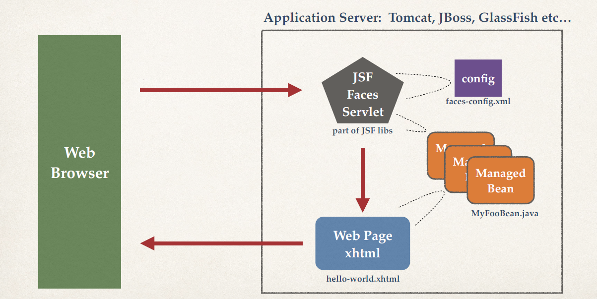

# JSF

- Framework for building web applications in Java
- Standard of Java Enterprise Edition (Java EE)
- Based on Model-View-Controller design pattern
- Anyone submit form data or click link, it will come into the controller.
- The view basically a page for rendering HTML, render result, HTML response.

### JSF Benefits

- Standard way of building web app UIs in Java
- Leverage a set of reusable UI components
- Help manage application state for web requests
- Process form data: validation, conversion etc

### How JSF Works Behind the Scenes



**JSF Faces Servlet**

- handles routing the request to the appropriate pages.
- It can read faces config file.
- It'll determine which page that it needs to rout to.
- It can also make use of **managed beans**(setter)
- It'll route it yo yhat appropriate web page.

**Managed Beans**

- hold form data
- talk to your backend process(DB)

**Web Pages**

- xhtml
- can make use of the **managed beans**(getter)
- retrieve info, display info
- webpage is rendered and send back browser

### JSF Bean Scopes

**Application Scope**
-   Bean is created once for application and shared by ALL users.
-   The update is for all users. When a user update some commont things, this update is made for all user.
```
@ManagedBean
@ApplicationScoped
public class ...
```

**Session Scope**
-   Bean is created once for user’s browser session. Unique for this user.
-   Commonly used when you need to keep track of the user’s actions
-   Example: Online Banking, Exams etc.
```
@ManagedBean
@SessionScoped
public class ...
```

**Request Scope**
-   New bean is created for every request. Short lived.
-   Commonly used for submitting form data …. one time use.
-   Note: This is the DEFAULT scope if none is specified.
-   Create a form to interact with the bean
-   When submit, only work one time.
```
@ManagedBean
@RequestScoped
public class ...
```
