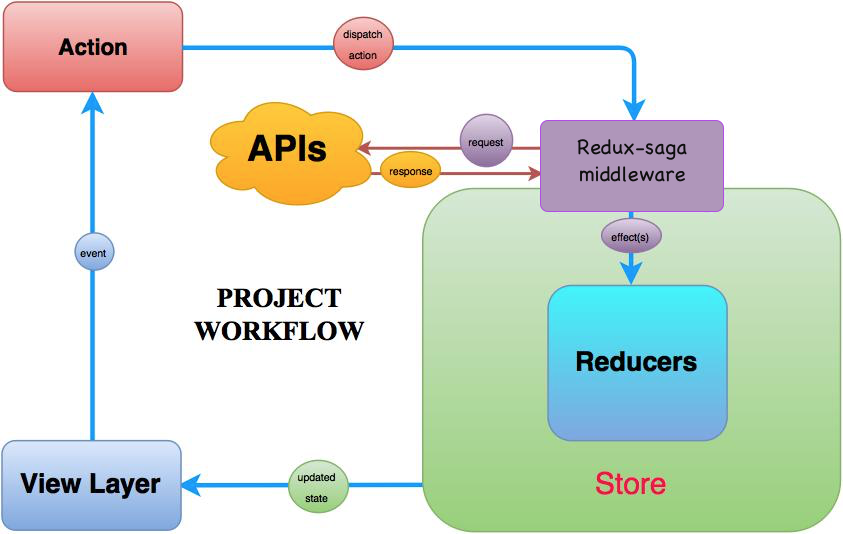
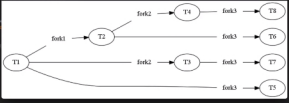

# Redux Saga

- When using React, in some cases, due to the nature of javascript, if it takes time, the processes do not wait and move to other processes, but if this data is critical, we need to wait for a while.
- The data is sent in the payload section has to be object. Sometimes we need to use api in action section. This operations run sametimes, and we may want them to be in order. Because of this situation, we use async. In the async axios operations or the operations(setTimeout) that we need to wait, the api operation is sent as a function in the payload part. This happens when converting from ES6 to ES5 and throws an error.

- Due to the above situations, we use Redux Saga to avoid the error.

- It waits response, and then updates the state.

- Firstly, watch is triggered after action when dispatch to action. 



## yield

```javascript
yield x(...) // Firstly, x function runs. After it ends, next function is y() runs. It is like an Async/await operation.
yield y(...)
```

```javascript
yield all; // Root saga is allow all these forked processes to be created in parallel.
```

## takeEvery

You want to watch for EVERY time a specific redux action was dispatched.
**Use cases**

- Getting / fetching a list of data from an API.
  **Example:**

```javascript
function* watchGetUsersRequest() {
  // takeEvery: when the all action.Types.GET_USERS_REQUEST are dispatched, it works.
  // it is watching every GET_USERS_REQUEST action.
  yield takeEvery(action.Types.GET_USERS_REQUEST, getUsers); //getUsers fonk is called in saga.
}
```

## call

You want to call a function or a promise but want to wait for that function or promise to finish running before executing the next line of code.
**Examples**

```javascript
  yield call(deleteUser, payload.userId);
```

```javascript
const result = yield call(api.getUsers);
```

## put

You want to dispatch a redux action from within a redux saga.
**Use cases**

- Any time you want to update your redux state - usually after a call to an API resolves and you want to update your redux state with the resulting data from the API.
  **Example**

```javascript
yield put(actions.getUsersSuccess({
			items: result.data.data
		}));
```

## take

- You want to watch for a particular redux action to be dispatched, but you don't want to listen for that same dispatched action again until the currently running saga for that action has complete. You're "blocking" the ability to watch for when that particular redux action is dispatched until the currently running saga for that redux action has complete.  
  **Use cases**

- Deleting a user
- Accepting a payment. Generally you don't want to be able to accept multiple, simultaneous payments - you'd want to wait for the current transaction to complete before allowing the ability to accept another payment.

**Example**

```javascript
function* watchDeleteUserRequest() {
  while (true) {
    const { userId } = yield take(action.Types.DELETE_USER_REQUEST);
    yield call(deleteUser, { userId });
  }
}
```

## takeLatest

- Almost similar to TakeEvery
- We clicked the button to add something. we assume that this process continues for 10 seconds. But at the 5th second, we click the button again. The first request is canceled and the last action runs.
  **Use cases:**
  - Creating or updating a record

**Example**

```javascript
function* watchCreateUserRequest() {
  yield takeLatest(actions.Types.CREATE_USER_REQUEST, createUser);
}
```

## Fork

- watchGetUser operation is a fork for getUser.
- If there is a issue on fork2, it doesn't affect other processes.
  

  ```javascript
  const userSagas = [
    fork(watchGetUsersRequest),
    fork(watchDeleteUserRequest),
    fork(watchCreateUserRequest),
  ];
  export default userSagas;
  ```
